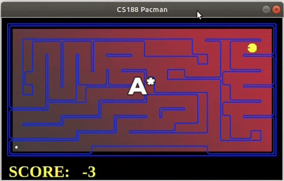

# Life-long planning

## Final Results Are At The Top for Easy Access



Team name- Lumpus

A repository to implement the D* Lite search algorithm in a pacman environment. The agent only sees its neighboring squares,
and can store information about the locations it has visited, and the structure of the walls surrounding those locations. It uses this information for fast replanning of path to goal in case an obstacle appears in the previously computed path.

If we use traditional planning algorithms like A* which just uses heuristics for planning, the agent has to recompute the entire path to goal state if an obstacle appears in the pre-computed path. This is redundant, and can be avoided by using a planning approach like D* lite which combines usage of incremental path planning and heuristics.

The objective was to compare the performance of D* Lite with A* search and A* search- Tunnel Vission(TV) to corroborate that D* Lite 
performs better (memory usage and computation time) than A* search for big and complex enough mazes as described in [this paper on D* Lite](http://idm-lab.org/bib/abstracts/papers/aaai02b.pdf) 
We present our results in terms of the number of nodes expanded for reaching the goal state, time taken (in seconds) to plan a path to the goal state and the final score achieved in the Pacman domain. 

## Getting Started
You can download project on your local machine for further development and testing. See Running the tests section for instructions on replicating our reults.

The code for three algorithms implemented can be found in search.py within the search folder.
The files for different mazes can be found in layouts folder within the search folder.

## Running the tests
We have used Linux environment for this project. The corresponding commands for running the tests are given below.

To run the D* Lite algorithm on 'bigMaze', execute the following line from inside the search folder
```
python pacman.py -l bigMaze -z  -p SearchAgent -a fn=dstar,heuristic=manhattanHeuristic
```
You can replace 'dstar' with 'astar2' or 'astartv' next to 'fn' in the stated command to run the respective algorithms. 

To test on different mazes, replace 'bigMaze' in the command with another maze like 'mediumMaze', 'smallMaze', 'tinyMaze'.

A* search implemetation in Pacman domain video- https://drive.google.com/file/d/1dJxdAXtt_TP36qseuFwgjHao1YwLrx1H/view?usp=sharing

A* search- Tunnel Vision implemetation in Pacman domain video- https://drive.google.com/file/d/12yHSP5GARA5iG13dDJndBeEIUmZIvLVx/view?usp=sharing

D* Lite implemetation in Pacman domain video- https://drive.google.com/file/d/1YwP7NWzpVlkjzU_yhGjMebTtfalB7fww/view?usp=sharing

## Results
#### 1. Number of nodes expanded by the algorithms discussed above for different mazes sizes and complexities were as tabulated below.

| Maze | D* Lite | A* search | A* search (TV) |
| ------------- | ------------- | ------------- | ------------- |
| bigMaze | 10979 | 54160 | 52085 |
| mediumMaze | 3251 | 8842 | 9481 |
| smallMaze | 669 | 548 | 582 |
| tinyMaze | 122 | 74 | 46 |

As expected the agent expands fewer nodes with D* Lite for bigMaze and mediumMaze with almost 5 times and 3 times fewer nodes respectively as compared to A* search and A* search (TV) for the same mazes. 
D* Lite results in higher number of expanded nodes for smallMaze and tinyMaze but not to the same degree as was the case for A* search and A* search (TV) for bigMaze and mediumMaze. 

#### 2. Time taken (in seconds) by D* Lite algorithm and A* search for path planning towards a goal for different mazes was-

| Maze | D* Lite | A* search | 
| ------------- | ------------- | ------------- |
| bigMaze | 1.3 | 8.2 |
| mediumMaze | 1 | 5.7 |
| bigCorners | 0.7 | 0.8 |
| tinySearch | 0.7 | 0.7 | 
| tinySafeSearch | 0.7 | 0.7 | 

As seen with the number of expanded nodes, the time taken by the agent for planning a path to the goal is also significantly lesser with D* Lite algorithm
than A* search for bigger sized mazes and equally good for smaller sized mazes.

#### 3. The final score achieved using the three search algortihms and different mazes were-

| Maze | D* Lite | A* search | A* search (TV) |
| ------------- | ------------- | ------------- | ------------- |
| bigMaze | 92 | 100 | 70 |
| mediumMaze | 428 | 420 | 420 |
| smallMaze | 473 | 473 | 471 |
| tinyMaze | 502 | 502 | 502 |

We can see that the agent consistently receives a higher or equal score for all the mazes using D* Lite as compared with other algorithms that were tested.  

The results tested over the three metrics- number of nodes expanded, time taken for path planning and the final score after the agent reaches the goal state show that D* Lite leads to better or just as good performance with lesser memory usage and computation time when compared with A* search and A* search (TV).

## Authors
* Sagar Khar- Research and Solution formulation
* Laukik Mujumdar- Code Implementation
* Malay Tushar Nagda- Testing and Bug fixes
* Prabal Bijoy Dutta- Analysis and Report Generation

## Acknowledgements
* This project was undertaken as part of Spring 2020 Artificial Intelligence course at ASU; taught by Prof. Yu Zhang.
* The supplementary files used are part of the broader project as developed by UC Berkely for Pac-Man domain.
* We used [D* Lite](http://idm-lab.org/bib/abstracts/papers/aaai02b.pdf) research paper for implementing our project.
